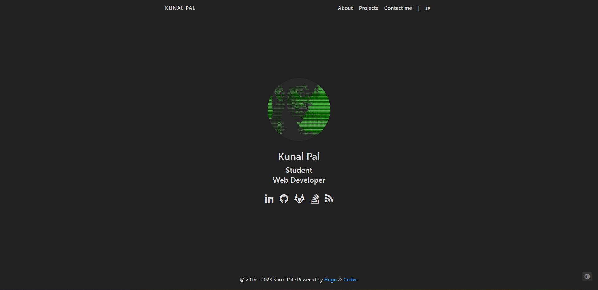
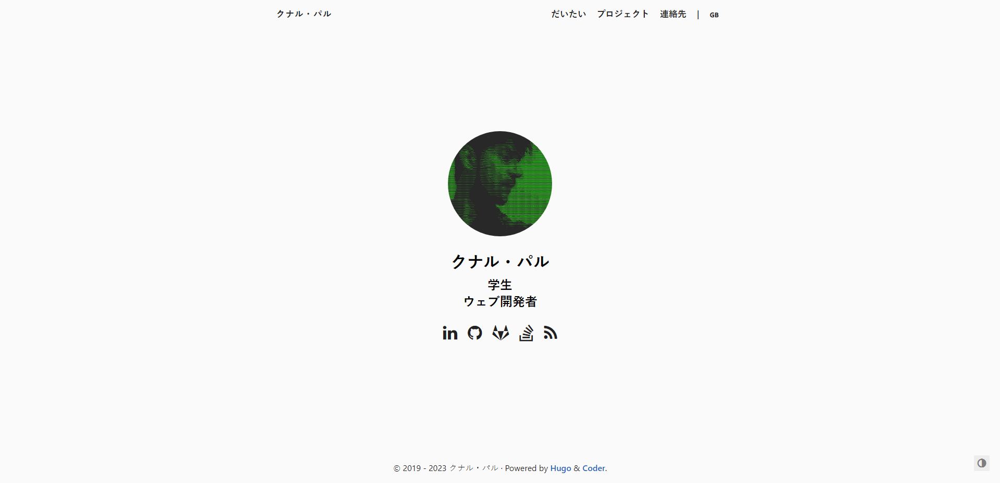

## Project Overview
This is the repository for my portfolio website, showcasing my work and skills as a developer/designer. The website is built using HTML, CSS, and JavaScript.

## Features
* Home page with an introduction and summary of my skills and experience
* Projects page with a list of my projects and links to their live demos and GitHub repositories
* About page with more information about me, my education, and work experience
* Contact page with a form for visitors to send me a message
* Responsive design for mobile and desktop devices 
* Robust, minimalist and swift website.

## Screenshots



## Tech Used
* HTML
* CSS
* JavaScript

## Getting Started

1. Clone the repository
```bash
git clone https://github.com/silentwraith03/profile
```
2.Open the index
## License
[MIT](LICENSE)

## Acknowledgements 
* ForkAwesome - icons