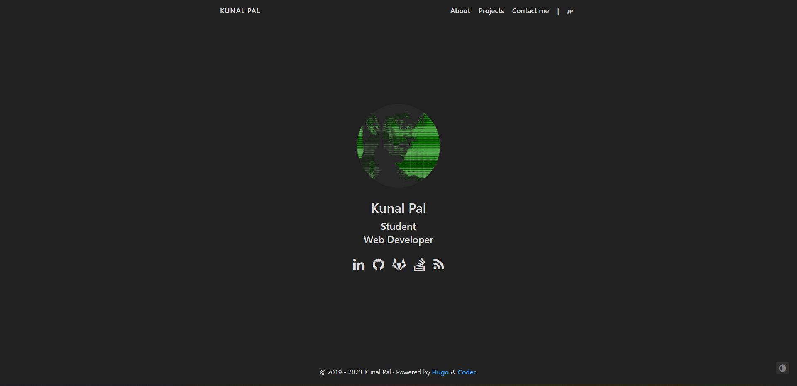
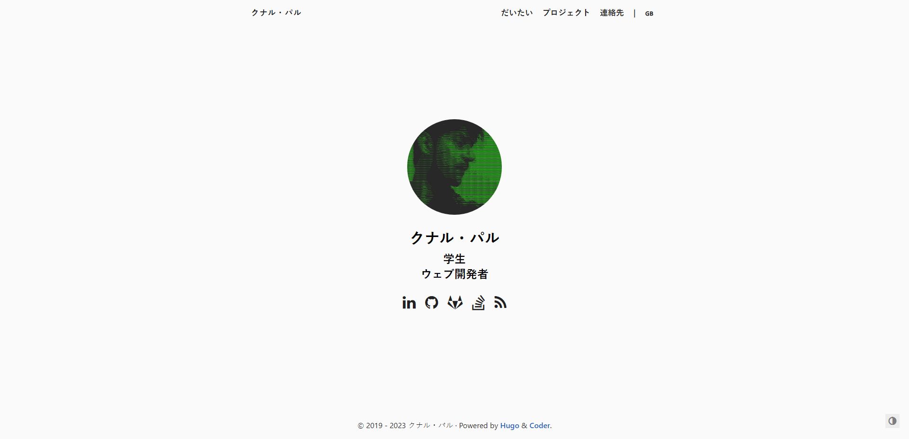

+++
author = "Kunal Pal"
title = "Portfolio Website"
date = "2023-01-18"
description = "Robust, minimalist and swift website."
tags = [
    "website",
    "hugo",
    "html,css,js",
]
+++
[Source Code](https://github.com/silentwraith03/profile)

## Overview
This is the repository for my portfolio website built using Hugo static site generator, showcasing my work and skills as a developer/designer. The website is built using HTML, CSS, and JavaScript.

## Features
* About page with more information about me, my education, and work experience
* Projects page with a list of my projects and links to their GitHub repositories
* Contact page to send me a message
* Responsive design for mobile and desktop devices 
* Robust, minimalist and swift website
* Available in Japanese

## Screenshots



## Tech Used
* HTML
* CSS
* JavaScript

## Getting Started

1. Clone the repository
```bash
git clone https://github.com/silentwraith03/profile
```
2. Install Hugo
```bash
brew install hugo
```
3. Configure your config.toml

4. Build your site with 
```bash
hugo server -D
``` 
   and see the result at http://localhost:1313/

## Acknowledgements 
* ForkAwesome - icons